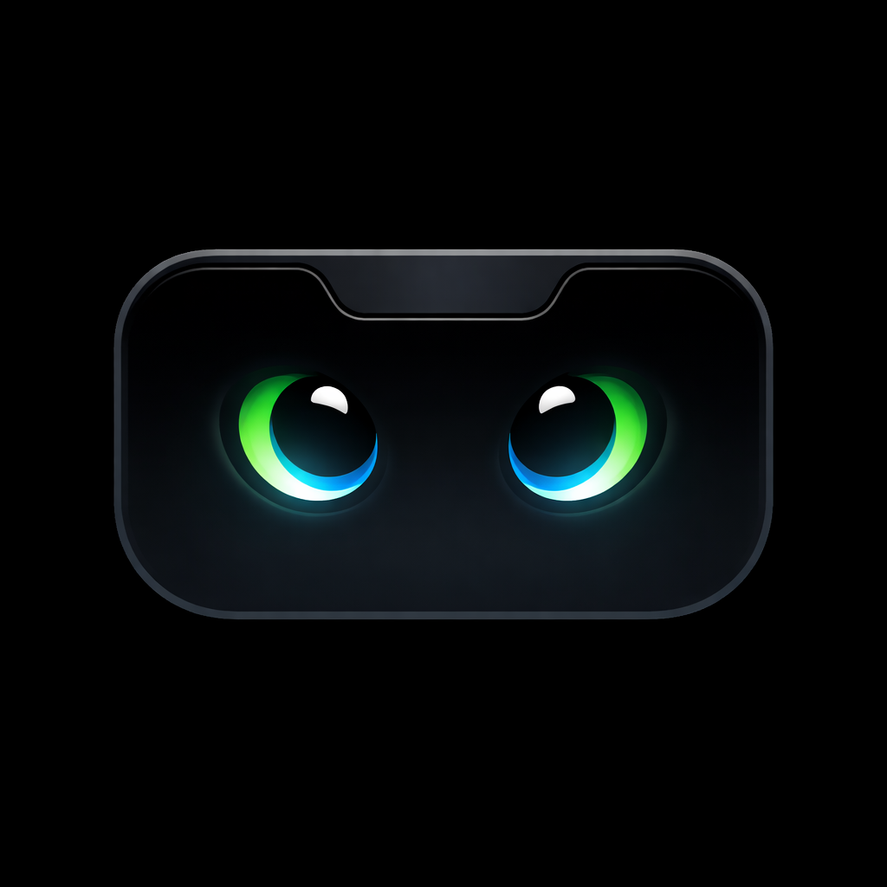

# Hatchling

> Your AI coding agents, hatched into a tiny notch.

Hatchling is a macOS menu‑bar app that turns your MacBook's notch into a
live status panel for every AI coding agent you have running — Claude
Code, Codex, Gemini CLI, Cursor, Copilot, and 12 other CLIs. Pet‑style
mascots tell you who's working, who's waiting, and who's idle, all
without leaving the menu bar.

<p align="center"></p>

## Features

- **17 CLIs supported** out of the box via Unix‑socket hooks: Claude
  Code, Codex, Gemini, Cursor, Trae (CN), Copilot, Qoder, Factory,
  CodeBuddy (CN), StepFun, AntiGravity, WorkBuddy, Hermes, Qwen Code,
  OpenCode.
- **One mascot per CLI source**, side‑by‑side in the notch — alerts
  first, working next, idle last.
- **Whimsical gerund verbs** (`Hatching…`, `Brewing…`, `Pondering…`,
  `Enchanting…`, …) replace the session counter while an agent is
  thinking.
- **Approval cards** with ghost‑style buttons. Optional **YOLO mode**
  to auto‑accept every permission request — with a bolt badge in the
  notch so you never forget it's on.
- **Per‑session context‑window meter**: model name + tokens used /
  context limit, parsed live from `~/.claude/projects/*.jsonl`.
- **Buddy ASCII pet** in Settings — 18 species, 5 rarities, hats,
  shiny variants, derived deterministically from `~/.claude.json`
  via wyhash. Even works after Anthropic removed `/buddy` from the
  CLI in v2.1.97.
- **Buddy speech bubbles**: occasional in‑character musings ("HONK!
  Esse commit tá horrível", "naptime in 5… 4… 3…"). Click to dismiss.
- **Anthropic status pill** at the top of the expanded panel — pulls
  status.claude.com every 5min; click opens the page.
- **Codex usage bar**: parses local rollout JSONL for primary (5h) /
  secondary (7d) rate‑limit windows.
- **Claude rate‑limit capture** via statusline wrapper (Claude Code
  v2.1.80+) — surfaces the same numbers as `claude.ai/settings/usage`
  in the notch, with transient `Claude 5h: 80%` warnings each time
  usage crosses a 5% bucket.
- **i18n**: English, Português (Brasil), 中文, Türkçe.

## Install

Download the latest `.dmg` from
[Releases](https://github.com/MikaelDDavidd/hatchling/releases),
open it, and drag **Hatchling.app** into **Applications**.

First launch will install hooks into every CLI you have configured
(`~/.claude/settings.json`, `~/.codex/hooks.json`, `~/.gemini/settings.json`,
`~/.cursor/hooks.json`, etc.). It also wraps your Claude Code statusline
so it can capture rate‑limit numbers; your existing statusline command is
preserved at `~/.codeisland/statusline-original.cmd` and called transparently.

## Build from source

```bash
git clone https://github.com/MikaelDDavidd/hatchling.git
cd hatchling
./build.sh
open .build/release/Hatchling.app
```

Universal binary (arm64 + x86_64). Code‑signed with whatever Apple
identity is in your keychain (falls back to ad‑hoc).

## Heritage

Hatchling is a hard fork of [`wxtsky/CodeIsland`][cs], itself
inspired by [`farouqaldori/claude-island`][ci]. The Buddy ASCII
pet system, WyHash and species table are adapted from
[`MioMioOS/MioIsland`][mio] (CC BY‑NC 4.0). Big thanks to all of
them — Hatchling wouldn't exist without their work.

What Hatchling adds on top:

- New brand + icon (the cyber‑eyed notch)
- Buddy ASCII surfaced as a first‑class Settings page (with stats
  and pet animation), independent of `/buddy` which Anthropic
  removed
- Buddy speech bubbles
- Anthropic statuspage pill
- Per‑session context meter
- Whimsical gerund verbs
- One‑per‑source mascot strip with attention ranking
- Claude rate‑limit capture via statusline wrapper
- YOLO auto‑accept toggle with always‑on indicator
- Português (BR) localization
- Adaptive panel width for non‑notch displays
- Auto‑fit panel height in completion mode

## License

MIT, matching the upstream `wxtsky/CodeIsland` license. The Buddy
ASCII data files inherit CC BY‑NC 4.0 from MioIsland and are not
redistributed for commercial use.

[cs]: https://github.com/wxtsky/CodeIsland
[ci]: https://github.com/farouqaldori/claude-island
[mio]: https://github.com/MioMioOS/MioIsland
