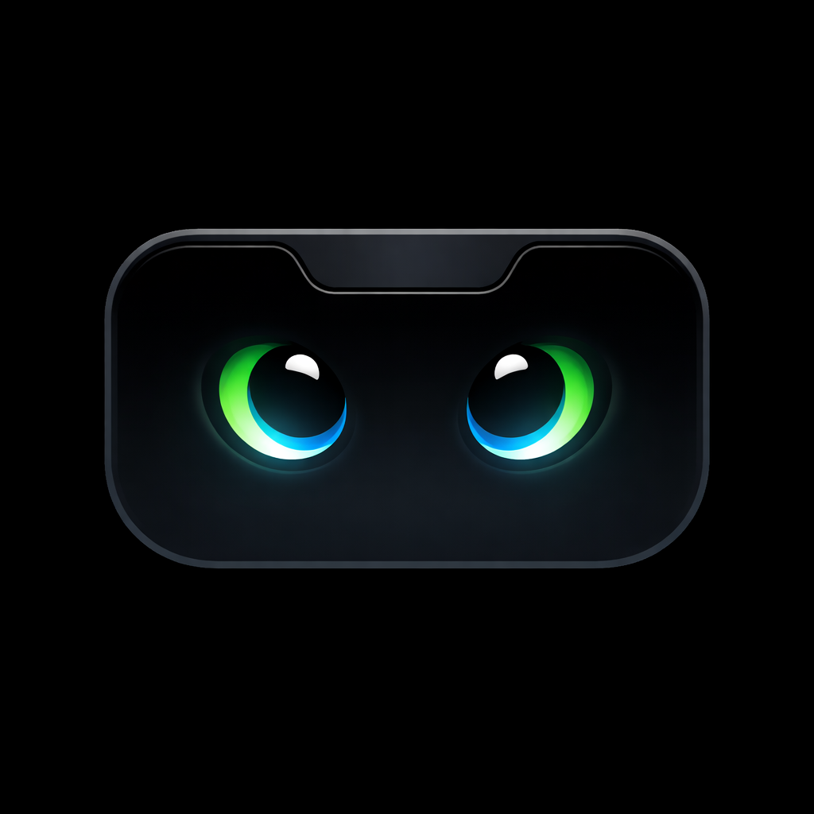

<div align="center">



# Hatchling

**Your AI coding agents, hatched into a tiny notch.**

A macOS menu‑bar status panel for every AI coding agent you have running — Claude Code, Codex, Gemini CLI, Cursor, Copilot, and 12 more — with live mascots, context meters, YOLO mode, and a buddy pet.

[](https://swift.org)
[](https://www.apple.com/macos/)
[](https://developer.apple.com/xcode/swiftui/)
[](LICENSE)
[]()

[](https://buymeacoffee.com/mikaeldavid)
[](https://github.com/sponsors/MikaelDDavidd)

</div>

---

## Overview

Hatchling turns your MacBook's notch (or menu bar) into a live cockpit for every AI coding agent you run. Pet‑style mascots tell you who's working, who's waiting on a permission prompt, and who's idle — without leaving the menu bar or alt‑tabbing into a terminal.

It hooks into 17 different CLIs through Unix sockets, parses local session files for context‑window and rate‑limit data, and surfaces it all in a single notch‑shaped panel that expands on hover. There's also a deterministically‑generated ASCII pet that lives in Settings, occasionally heckles your commits, and survives Anthropic removing `/buddy` from the Claude CLI.

<p align="center">
  
</p>

### Key Features

- **17 CLIs supported** out of the box — Claude Code, Codex, Gemini, Cursor, Trae, Copilot, Qoder, Factory, CodeBuddy, StepFun, AntiGravity, WorkBuddy, Hermes, Qwen Code, OpenCode, Droid, and more
- **One mascot per source** — side‑by‑side in the notch, ranked by attention (alerts first, working next, idle last)
- **Whimsical gerund verbs** — `Hatching…`, `Brewing…`, `Pondering…`, `Enchanting…` replace the session counter while an agent is thinking
- **Approval cards with YOLO mode** — ghost‑style buttons for permission requests, plus an opt‑in auto‑accept toggle with a permanent bolt badge so you never forget it's on
- **Per‑session context meter** — model name and tokens used vs. context limit, parsed live from `~/.claude/projects/*.jsonl`
- **Buddy ASCII pet** — 18 species, 5 rarities, hats, and shiny variants, derived deterministically from `~/.claude.json` via wyhash; works even after Anthropic removed `/buddy` from the CLI in v2.1.97
- **Buddy speech bubbles** — occasional in‑character musings ("HONK! Esse commit tá horrível", "naptime in 5… 4… 3…"); click to dismiss
- **Anthropic status pill** — pulls `status.claude.com` every 5 minutes; click opens the page
- **Codex usage bar** — parses local rollout JSONL for primary (5h) and secondary (7d) rate‑limit windows
- **Claude rate‑limit capture** — via a transparent statusline wrapper (Claude Code v2.1.80+); surfaces the same numbers as `claude.ai/settings/usage`, with transient warnings each time usage crosses a 5% bucket
- **i18n** — English, Português (Brasil), 中文, Türkçe

### Mascot Gallery

<p align="center">
  
  
  
  
  
  
  
  
  
</p>

## Tech Stack

- **Language**: Swift 5.9
- **UI**: SwiftUI + AppKit (menu bar / NSStatusItem hybrid)
- **Build system**: Swift Package Manager (universal binary, arm64 + x86_64)
- **Targets**:
  - `CodeIsland` — main `.app` bundle
  - `CodeIslandCore` — shared library (event normalizer, models, socket paths, chat formatter)
  - `codeisland-bridge` — sidecar helper that brokers the Unix‑socket hooks
- **IPC**: per‑agent Unix domain sockets, populated by hooks installed into each CLI's settings
- **Distribution**: signed `.dmg` (Developer ID + notarization) built via `build.sh` / `scripts/build-dmg.sh`
- **Min macOS**: 14 (Sonoma)

## Getting Started

### Install (recommended)

Download the latest `.dmg` from [Releases](https://github.com/MikaelDDavidd/hatchling/releases), open it, and drag **Hatchling.app** into **Applications**.

On first launch Hatchling installs hooks into every CLI you have configured (`~/.claude/settings.json`, `~/.codex/hooks.json`, `~/.gemini/settings.json`, `~/.cursor/hooks.json`, etc.). It also wraps your Claude Code statusline so it can capture rate‑limit numbers — your existing statusline command is preserved at `~/.codeisland/statusline-original.cmd` and called transparently.

### Build from source

Prerequisites:

- macOS 14 (Sonoma) or newer
- Xcode 15+ command‑line tools (Swift 5.9)

```bash
git clone https://github.com/MikaelDDavidd/hatchling.git
cd hatchling
./build.sh
open .build/release/Hatchling.app
```

The build script produces a universal binary (arm64 + x86_64), code‑signed with whatever Apple identity is in your keychain (falls back to ad‑hoc signing if none is found). Pass `--notarize` to additionally submit to Apple's notary service and build a signed DMG.

### Running tests

```bash
swift test
```

## Project Structure

```
.
├── Sources/
│   ├── CodeIsland/          # Main app — SwiftUI views, AppDelegate, hook server, mascots
│   ├── CodeIslandCore/      # Shared models, event normalizer, socket paths, chat formatter
│   └── CodeIslandBridge/    # Sidecar helper that brokers Unix-socket hooks
├── Tests/
│   ├── CodeIslandCoreTests/ # Core library tests
│   └── CodeIslandTests/     # App-level tests
├── Assets.xcassets/         # App icon catalog
├── AppIcon.icon/            # Source icon (compiled by build.sh)
├── Info.plist               # Bundle metadata
├── Hatchling.entitlements   # Sandboxing / capabilities
├── Package.swift            # SwiftPM manifest (arm64 + x86_64 targets)
├── build.sh                 # Universal build + sign (+ optional notarize)
├── scripts/
│   ├── build-dmg.sh         # Notarized DMG packaging
│   └── extract-changelog.sh # Pulls a single version's notes from CHANGELOG.md
└── docs/images/             # Screenshots and mascot GIFs
```

## Heritage

Hatchling is a hard fork of [`wxtsky/CodeIsland`][cs], itself inspired by [`farouqaldori/claude-island`][ci]. The Buddy ASCII pet system, WyHash, and species table are adapted from [`MioMioOS/MioIsland`][mio] (CC BY‑NC 4.0). Big thanks to all of them — Hatchling wouldn't exist without their work.

What Hatchling adds on top of upstream:

- New brand and icon (the cyber‑eyed notch)
- Buddy ASCII surfaced as a first‑class Settings page with stats and pet animation, independent of `/buddy`
- Buddy speech bubbles
- Anthropic statuspage pill
- Per‑session context meter
- Whimsical gerund verbs
- One‑per‑source mascot strip with attention ranking
- Claude rate‑limit capture via statusline wrapper
- YOLO auto‑accept toggle with always‑on indicator
- Português (BR) localization
- Adaptive panel width for non‑notch displays
- Auto‑fit panel height in completion mode
- Git checkpoints — snapshot the working tree before the agent edits it, as an orphan commit under a private ref (bindable shortcut)
- Stays quiet while you're on a call, and keeps the Mac awake while an agent is working
- Chiptune sound set, with per‑sound debounce

## Support

Hatchling is free and MIT-licensed. If it saves you a few glances at the terminal, you can
say thanks:

<a href="https://buymeacoffee.com/mikaeldavid"></a>
<a href="https://github.com/sponsors/MikaelDDavidd"></a>

Starring the repo and reporting bugs helps just as much.

## License

Distributed under the MIT License, matching the upstream `wxtsky/CodeIsland` license. See [LICENSE](LICENSE) for details. The Buddy ASCII data files inherit CC BY‑NC 4.0 from MioIsland and are not redistributed for commercial use.

Third-party code and assets adapted into Hatchling — including sounds and features ported from
[`bones7456/notchy`](https://github.com/bones7456/notchy) — are credited in [THIRD-PARTY.md](THIRD-PARTY.md).

[cs]: https://github.com/wxtsky/CodeIsland
[ci]: https://github.com/farouqaldori/claude-island
[mio]: https://github.com/MioMioOS/MioIsland

---

<div align="center">
Built by <a href="https://github.com/MikaelDDavidd">Mikael David</a>
</div>
